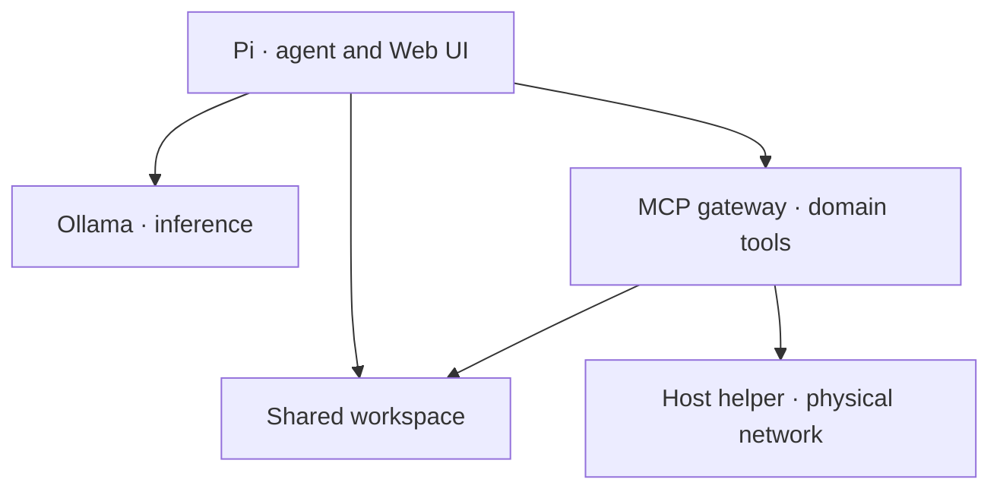

<div align="center">

# 🐇 Pi Docker

**A local agent, a stock runtime, and a small tool surface.**

`r24` · `Pi 1.1.0` · `Web UI 0.100.0` · `32K context`

[Quick start](#quick-start) · [Operations](docs/OPERATIONS.md) · [Development](docs/DEVELOPMENT.md)

</div>

Pi Docker runs the stock Pi SDK and Web UI with external extensions for bounded discovery, scheduling and durable evidence. Ollama provides inference; the separate MCP gateway provides host, browser, account and network capabilities.

## At a glance

| Feature | Behavior |
| :--- | :--- |
| Stock runtime | One locked SDK shared by CLI and Web UI; upstream files remain read-only |
| Small tool surface | Eight permanent declarations; specialized operations load on demand |
| Durable evidence | Redacted archives, selective retrieval and execution provenance |
| Bounded context | 32,768-token model cap; 8,192-token compaction reserve |
| Model trials | Qwen preparation, probes, guarded activation and restore |
| Deployment visibility | Loaded release, extension version and source digest |

## Quick start

Start the Ollama and MCP projects first, then:

```bash
cd ~/Projects/pi-docker
bash scripts/init.sh
```

Open **http://127.0.0.1:8787**. The initializer creates `.env`, state directories, the dedicated workspace and `ai-local` when needed, builds the image, and validates it.

Existing `.env`, `data/` and `workspace/` hold local configuration and state. Set `PI_WEB_TOKEN` in `.env` if needed. The supplied stack installer replaces source while preserving those paths and Git history.

## How the projects fit



Pi reaches Ollama through `host.docker.internal:11434`. MCP services use the external Docker network `ai-local`. Set the gateway's `MCP_WORKSPACE_PATH` to this repo's `workspace` so generated files are visible to both projects.

## Tools

| Permanent tools | Purpose |
| :--- | :--- |
| `read`, `edit`, `write` | Workspace files |
| `bash` | Pi-container workspace shell |
| `tool_search`, `tool_invoke` | Discover and execute authorized operations |
| `result_get`, `result_list` | Retrieve archived evidence and locate references |

`result_search`, `atomic_batch`, `ollama_api_inventory` and `mcp_endpoint_health` are deferred operations. Discover them when needed. `result_search` searches earlier result content; `result_get` reads a known archive reference. Security's `read_security_result` reads server-side JSON artifacts and uses a separate path boundary.

## Daily commands

```bash
bash scripts/status.sh
bash scripts/logs.sh
bash scripts/sync-models.sh
bash scripts/validate-image.sh
```

In a Pi session, `/atomic-version` displays the loaded release and source digest; `/atomic-report` displays the assessment ledger.

## Runtime pins

| Component | Version |
| :--- | :--- |
| Pi coding agent | 1.1.0 |
| Pi Web UI | 0.100.0 |
| Atomic tool/results | 0.2.3 |
| Native services bridge | 1.0.0 |

`runtime/package-lock.json` controls installation through `npm ci`. Old version variables in `.env` do not change these pins. The native bridge uses public SDK factories; custom code stays outside installed upstream packages.

## Verification

The image checks SDK compatibility, fixed provider declarations, Web UI settings replay, native MCP fixtures, Qwen probes and upstream integrity during its build. Run `bash scripts/check.sh` inside the Pi container for the full source suite. See [development](docs/DEVELOPMENT.md) for local dependency paths and validation limits.

[Operations and troubleshooting →](docs/OPERATIONS.md)

Discovery results remain archived, but default `result_list` and `result_search` exclude `tool_search`. Use an explicit `tool: "tool_search"` filter for diagnostics; known refs remain readable through `result_get`.
